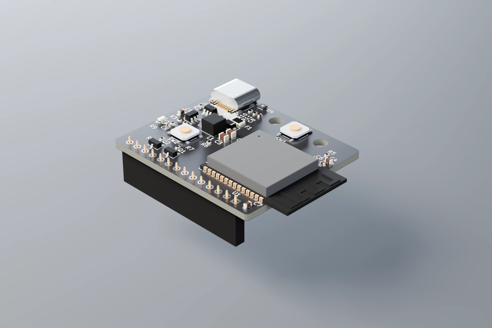

# desk-dashboard-hw

A small ESP32-S3 board that plugs onto the 14-pin header of an **MSP3526** 3.5" IPS
capacitive touchscreen (ST7796 + FT6336U) and turns it into a desk dashboard.
Powered over USB-C (5 V). KiCad 10 project.

**Status:** schematic and PCB finished (ERC 0 errors, DRC 0 errors, fully routed).
!NOT TESTED ON ACTUAL HW YET!

## Features
- ESP32-S3-WROOM-1-N16R8 (16 MB flash, 8 MB octal PSRAM), native USB on the USB-C connector
- Plugs straight into the display's 14-pin 2.54 mm header, no cables; two optional M3 standoffs
- Ambient light sensor (ALS-PT19) for automatic backlight control
- SHT40 temperature / humidity sensor on its own I²C bus
- BOOT and RESET buttons
- 5 V to 3.3 V buck (TLV62569), USB ESD protection (USBLC6-2SC6), 1.1 A PTC and TVS on VBUS

## Board
- 41.5 x 35 mm, 2 layers, 1.6 mm, black solder mask, white silkscreen
- The ESP32 antenna overhangs the right board edge by 6 mm (Espressif's preferred placement)
- J2 (display socket) is on the display-facing side; all other parts face outward

## Design notes
- The display is powered from **5 V**: its LDO also feeds the backlight, which would be dim at 3.3 V.
- The display's touch I²C has 10 k pull-ups to 5 V, so two BSS138 level shifters (Q1 SCL, Q2 SDA)
  keep 5 V away from the ESP32-S3.
- The SHT40 is on a separate I²C controller from the touch panel.
- The light sensor is on ADC1 (ADC2 conflicts with Wi-Fi).

## Parts
All parts were in stock at JLCPCB when the design was finished. Each schematic symbol carries an
`LCSC` field with its part number.

| Ref | Part | LCSC |
|---|---|---|
| U1 | ESP32-S3-WROOM-1-N16R8 | C2913202 |
| U2 | TLV62569DBVR | C141836 |
| U3 | USBLC6-2SC6 | C2687116 |
| U4 | SHT40-AD1B-R2 | C2909890 |
| J1 | USB-C HRO TYPE-C-31-M-12 | C165948 |
| J2 | 1x14 female header, 2.54 mm, 8.5 mm | C2897377 |
| Q1, Q2 | BSS138 | C78284 |
| Q3 | ALS-PT19-315C | C146233 |

Passives, buttons, PTC, TVS and the inductor are listed in the schematic.

## Display
LCDwiki MSP3526 (3.5" IPS, 320x480, ST7796 + FT6336U), sold by several resellers. Check that the
header pin labels match the J2 order above before buying.

## License
MIT, see LICENSE
